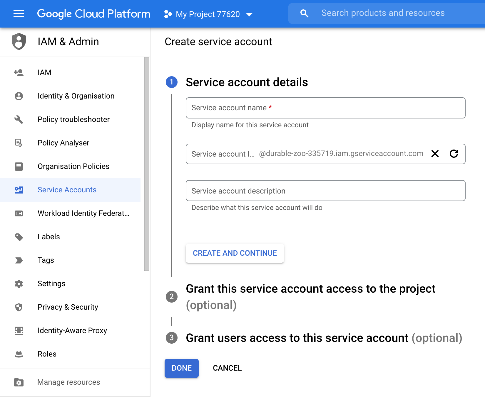
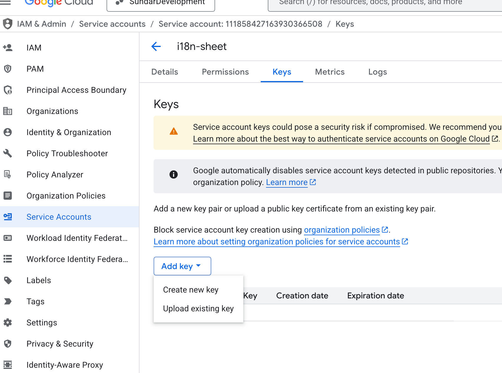
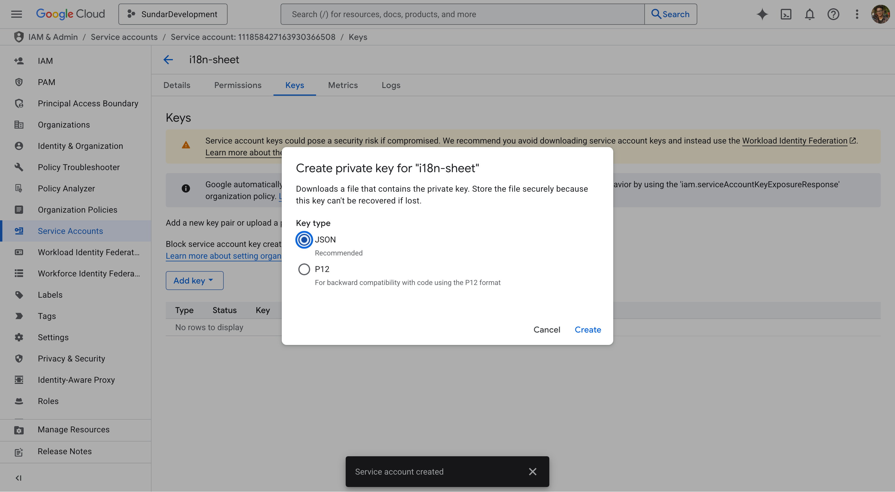

# i18n-sheet-parser

🇬🇧 🇪🇸 🇫🇷 🇩🇪 🇵🇱 🇨🇳

i18n-sheet-parser is a tool that addresses one of the biggest [i18n](https://en.wikipedia.org/wiki/Internationalization_and_localization) issue. Namely, it provides frictionless way
of cooperation between language translators and developers.

## 💡 How it works?

i18n-sheet-parser uses Google Spreadsheets for translations single source of truth because it is an acceptable tool 
for non-technical people (Excel-like tools are pretty common and have low entry threshold). The spreadsheet
has some structure where part of it is filled by the developer and the other part is to be completed by
the language translator.

The structure of the spreadsheet is as bellow:
Markup

For i18n-sheet-parser to know how to handle your translations, You need to stick with very simple spreadsheet markup.

Rules:

    it ignores every row until metadata row is found
    metadata row is first row that contains >>> marker; it defines first level of translation keys
    any further >>> marker indicates next key levels.
    you define various locales in next columns, but in same row as markers
    optionaly, you can introduce the tags column ### where you can tag every key (then fine tune the targets by selecting tags that to be included)
    every next row is parsed for translations


Then, to include these translations in the app, i18n-sheet-parser provides some API
that is able to fetch, parse and write translations defined in the spreadsheet 
into your file system in the format you want.

## 🧰 Prerequisites

Before you begin the setup of the i18n-sheet-parser, you need to create a Google Service Account, so
i18n-sheet-parser will be able to perform some actions on Google Services in your behalf.

To do that, go to your [Google Cloud Platform's Dashboard](https://console.cloud.google.com/) first. If you are using it for 
the first time, you may have to create your first Project there to be able to perform any actions. 
So, select some existing project in which scope you would like to store the translations, or create a new one.


Then [create service account](https://console.cloud.google.com/iam-admin/serviceaccounts/create) in that project's scope.
You can name it however you want. In terms of the account access setup, you don't need to add any role for this account so
just click "Continue" button on this step. Also, the other "Grant users access to this service account" step is optional too.



When you create the service account, open its details manager by clicking its e-mail from the list.
Then generate new JSON-format credentials like follows:

1. Open "KEYS" tab
2. Click "ADD KEY" drop down 
3. Select "Create new key"
4. Make sure that "JSON" format is selected in the dialog that popped up 
5. Click "CREATE"
6. Save the downloaded file in your project's root directory and name it `.credentials.json`
7. Although the created service account does not have too much permissions, 
   it's recommended that you add this file to `.gitignore` in your project and distribute it
   among the developers that are involved in your project in other way.
   

## 🔧 Installation

### npx way

If you have `npx` installed, you can run the following command to initialize the i18n-sheet-parser
in your project directory:

```bash
npx i18n-sheet init
```

### Global way

Alternatively, if you don't have `npx` you can install i18n-sheet-parser CLI tool globally:

```bash
npm i -G i18n-sheet
```

...and then you should be able to execute following command whenever you want to set up i18n-sheet-parser 
for some of your projects:

```bash
i18n-sheet init
```

### Next steps

The i18n-sheet-parser CLI leads you by hand during init process. It will share the spreadsheet file (on the e-mail and as a link in the console output) with you
where you can fill first translation keys. The next thing that you will probably need is
to share that spreadsheet with language translators, and the developers that work on the same project.
Also, as mentioned in the "Prerequisites" section above, you may need to share the `.credentials.json` file
with the developers so they are able to run the translation fetching script.

If everything has been set up correctly, you should be able to run the translation fetching script for instance like this
(it depends on the configuration):

```bash
npm run translations
```

...and this will update the translation files each time you run it basing on the Google Spreadsheet file content.

### Comment on further automation

You may want to execute this script during the build process or for instance on some CI. This is doable,
however we recommend you to execute the translations fetching script manually to be able to perform last check
of translations if they are ok before committing them into the repository. This way you may avoid a risk of 
deployment of some mistake straight ahead into production environment. Remember, the mistakes happen, especially
when non-technical people are involved in the process. They may for instance edit the wrong cell 
and break the translation files structure unintentionally by doing so.